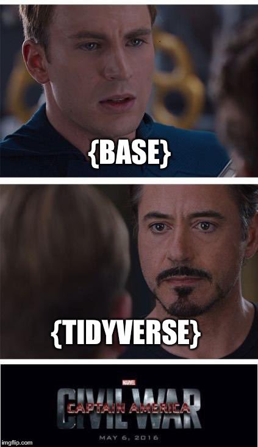

## Agenda

.pull-left[1. The Philosophy
2. The Basics
3. The Extras]

---

## The Philosophy

"`dplyr` is a grammar of data manipulation, providing a consistent set of **verbs** that help you solve the most common data manipulation challenges."

<div style='text-align: right;'> — https://dplyr.tidyverse.org/ </div>
<br>

.pull-left[
- If `R` is a language, `dplyr` is a dialect
- Main focus on data munging within the R ecosystem:
    - You're gonna wanna use `tibble()`s
- Focuses on elegance, readability, parsimony, and reproducibility
- Part of the `tidyverse`, so works well with all of their packages
]
.pull-right[

]


---

## The Philosophy

- `dplyr` abstracts base R; does not replace direct knowledge
- Not very widely scoped; wouldn't use it for out-of-`tibble()` situations (but many situations in R can be manipulated into `tibble()`-friendly ones)
- Elegant, but not the fastest; with very large datasets, `data.table` is faster ([source](https://github.com/Rdatatable/data.table/wiki/Benchmarks-%3A-Grouping))

---

## The Basics

*"I claim that most single table problems can be solved with just five key verbs: filter, select, mutate, arrange and summarise, along with a 'by group' adverb."*

.pull-right[— [Hadley Wickham](https://stackoverflow.com/questions/21435339/data-table-vs-dplyr-can-one-do-something-well-the-other-cant-or-does-poorly/27840349#27840349)]
---

## The Basics | `%>%`
**Pipes** conjoin each `dplyr` verb by saying "and then...".

```{r}
library(dplyr, warn.conflicts = FALSE, quietly = TRUE)

iris %>%
  head() #note the indentation for readability
```

---

## The Basics | `%>%`

- Typically, you could just do `head(iris)`: parsimonious & readable!
- What if you had 3, 4, or more functions wrapping around one object?

e.g. what are the coefficients of a linear model predicting Species in iris, using only rows where Sepal.Length is greater than the mean Sepal Length?

```{r, warning=FALSE}
coef(lm(Species ~., data=subset(iris, iris$Sepal.Length > mean(iris$Sepal.Length))))
```

- Some programmers suggest breaking up their compound lines by assigning outputs to variables incrementally, e.g.

```{r, eval=FALSE}
meanSepal = mean(iris$Sepal.Length)
subsdf = subset(iris, iris$Sepal.Length > meanSepal)
# etc...
```

- Really, tho...?
---

## The Basics | `%>%`

In dplyr, it looks like this:

```{r, warning=FALSE}
iris%>%                                           # the noun
  filter(Sepal.Length > mean(Sepal.Length))%>%    # first verb
  lm(Species ~ ., data=.)%>%                      # second verb
  coef()                                          # last verb
```

---

## The Basics | `.`

- Formulas in R can make use of a period or dot operator: `lm(Species ~ ., data=iris)`. The dot refers to "all variables except those on the LHS/RHS". 
- In `dplyr` (really, `magrittr`), the dot refers to the noun being passed around, and is implicit by default.
- It is described as a "dummy parameter" or "placeholder"

```{r}
iris%>%                     # iris%>%
  head(2)                   #   head(x=.,n=2)
```
- There are some nuances to its use that will come up as you get into more advanced operations
---

## The Basics | `select()`

- Most important verb to understand
- For selecting columns or variables (as long as object is a kind of dataframe)

```{r}
iris%>%
  select(Sepal.Length, Petal.Length)%>%
  head(3)
```

- Compare with bracket `[,]` indexing:

```{r}
head( iris[, grep("Length$", names(iris))], 3)
```
---

## The Basics | `select()`

So many helper functions with `select()`!!!

- `-` to drop, `Var1:Var5` for a range, `c(...)` for vectors
- `starts_with()`, `ends_with()`, `contains()`, `matches("regular_expression")` for regular expressions
- `one_of(c(...))` for optional matching
- `everything()` for everything that's left

```{r}
iris %>% 
  select(ends_with("Length")) %>%
  head(3)
```

---

## The Basics | `filter()`

- For selecting rows of a dataframe

```{r}
iris%>%
  filter(Species == "setosa")%>%
  head(3)
```

- Compare with `which()`

```{r}
head( iris[which(iris$Species == "setosa"), ] ,3)
```
---

## The Basics | `mutate()`

- Use `mutate()` to add new columns onto the dataframe (and use `transmute()` to only return the new column)
- Implicitly calls `select()`

```{r}
iris %>%
  mutate(Sepal.Area = Sepal.Length*Sepal.Width) %>%
  head(3)
```
---

## The Basics | `arrange()`

- Sort by variable(s)

```{r}
iris %>%
  arrange(-Sepal.Length, -Sepal.Width) %>%
  head(3)
```

- Also respects grouping variables, too!
---

## The Basics | `summarise()`

- Takes a range of rows and applies some function to return a dataframe of one value:

```{r}
iris %>%
  summarise(my_mean=mean(Petal.Length))
```

---

## The Basics | `group_by()`

- Applies a grouping arrangement to be passed on to other functions further on
- All basic functions in `dplyr` respect grouping

```{r}
iris %>%
  group_by(Species) %>%
  summarise(my_mean=mean(Petal.Length))
```

- You can group by as many variables as you'd like

---

## The Basics | `gather()`

- `gather()` is great for turning wide-form data into long-form. Args as follows:
```
gather(key = name the variable stack,
        value = name the values,
        ... = which variables to gather (use select() helpers))
```
```{r}
library(tidyr)
iris %>%
  gather(Petal_metric, value, starts_with("Petal")) %>%
  head(10)
```

---

## The Basics | `spread()`

- The complement to `gather()`
```
spread(key = the variable to unstack,
        value = the variable with your stacked values)
```
```{r}
library(tibble)
iris %>%
  rownames_to_column("index") %>%                         # ?!?!
  gather(Petal_metric, value, starts_with("Petal")) %>%
  spread(Petal_metric, value) %>%
  arrange(as.numeric(index)) %>%                          # ?!?!
  head(5)
```

- ?!?! One quirk: `spread()` needs specific row indeces to unravel its values; throw in an explicit column index and order 
---

## The Basics | Other Common Functions

- `separate()`/`unite()`
  - Complementary string column "split" and "concatenate"

- `*_join()`
  - Traditional SQL-style joins (but with a nicer interface than `merge()`,`sqldf`, etc.)

- `sample_n()`/`sample_frac()`
  - Sampling rows of a dataframe (with or without replacement)
  - Much clearer than `iris[ sample(nrow(iris), n), ]`

- `slice()`
  - Positional row indexing

- Remember to `ungroup()` explicitly!
- Remember to use `rowwise()` to iterate (like calling `apply(MARGIN=2)`), because [R does not like iterating rows naturally](https://milesmcbain.xyz/rstats-anti-pattern-row-wise/); it's vectorised!

---

## The Extras | list-columns

- You can `nest()` dataframes and lists in `dplyr` to create list-columns

```{r}
iris%>%
  nest(-Species)%>%
  as_tibble()             # for viewing on this slide
```

- You can then map operations on the list's objects with the `purrr` package (that's a topic for another day, though)

---

## The Extras | list-columns

- Remember `summarise()`? It only works if the return of the summary gives you a single value vector. Using list-columns can help us override this
- What are the quantiles of `Sepal.Length` for each species of iris?

```{r}
#base R, you'd have to call this three times for each species
quantile( iris[which(iris$Species == "setosa"), "Sepal.Length"] )
```

```{r, error=TRUE}
#dplyr without list-columns returns an error

iris %>%
  group_by(Species) %>%
  summarise(quant=quantile(Sepal.Length))

```

---

## The Extras | list-columns

```{r}
# instead, just coerce the return value into a list-column
iris %>%
  group_by(Species) %>%
  summarise(Sepal_Length_quants = list(quantile(Sepal.Length)))
```

---

## The Extras | list-columns

```{r}
iris %>%
  group_by(Species) %>%
  summarise(Sepal_Length_quants = list(quantile(Sepal.Length))) %>%
  .$Sepal_Length_quants
```

---

## The Extras | Scoped `filter_*()`

- You can create complex filtering conditions using scoped filters like `filter_at()`, `filter_all()`, and `filter_if()`
- These will return the rows of a dataframe once filtered on the specific variable predicates

e.g. let's filter only length variables from iris, where the length is greater than 5 for either of them

```{r}
iris %>%
  filter_at(.vars = vars(contains("Length")),
            .vars_predicate = any_vars(. > 5)) %>%
  head(3)
```

- Note the use of `vars()`, which explicitly calls `select()` helpers

---

## The Extras | Scoped `mutate_*()`

- Similarly, there are scoped mutate and summarise calls

e.g. multiply only numeric variables by 2

```{r}
iris %>%
  transmute_if(is.numeric, 
               funs(new = . * 2)) %>%
  head(3)
```

---

## The Extras | Scoped `summarise_*()`

e.g. Let's summarise only width variables to get their means

```{r}
# admittedly, this is overcomplicated
iris %>%
  summarise_at(vars(ends_with("width")), 
               funs(mean)) %>%
  head(3)
```
- Note the use of `funs()`, which can accept any number of custom functions
---
## Conclusion

- `dplyr` makes data munging cleaner and more interpretable
- There are lots of useful hidden functions under the hood
- Doesn't replace knowledge of base R
- Doesn't scale to HPC scenarios; best for making table summarisations and operations easier
- Huge community support means that you can figure out pretty much anything eventually
---
class: center, inverse
.center[# Thank you!]
